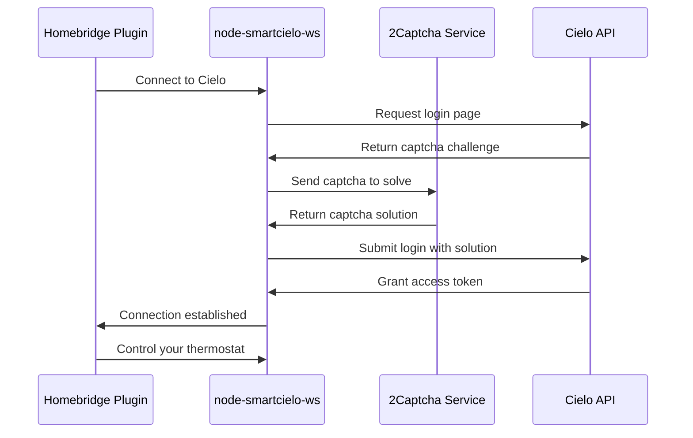

# Cielo Thermostat Homebridge Plugin

[](https://github.com/ryanfroese/homebridge-smartcielo/blob/master/LICENSE)
[](https://www.npmjs.com/package/homebridge-smartcielo)
[](https://www.npmjs.com/package/homebridge-smartcielo)

This plugin allows HomeKit to control Cielo mini splits using the [`node-smartcielo-ws`](https://github.com/ryanfroese/node-cielo) package.

## Important: Version 2.0+ Requires 2Captcha

**Why the change?** Cielo recently added captcha protection to their login page, which means automated tools (like this plugin) can no longer log in without solving captchas. To continue using this plugin, you'll need a 2Captcha account.

**What is 2Captcha?** It's a service that solves captchas automatically for a small fee (about $0.003 per captcha). The plugin only needs to solve a captcha when reconnecting to Cielo's servers, which happens rarely (typically 1-15 times per month during network issues).

**Expected cost:** Most users will spend $0.01-0.05 per month. The connection stays active even after your login expires, so you're not being charged constantly.

**Disclaimer:** I have no affiliation with 2Captcha and take no responsibility for their service. It's simply the solution I found during my research to get this plugin working again after Cielo added captcha protection.

## Setup Instructions

### Step 1: Get a 2Captcha API Key

1. Go to [2captcha.com](https://2captcha.com/)
2. Click "Sign Up" and create an account
3. Add funds to your account (minimum $3)
4. Go to your dashboard and copy your API key (it looks like a long string of letters and numbers)

### Step 2: Configure the Plugin

Use the Homebridge UI to configure the plugin with:

- **2Captcha API Key**: The API key you copied from 2captcha.com
- **Username**: Your Cielo account email
- **Password**: Your Cielo account password
- **IP Address**: Your public IP address (used as a session identifier)
- **MAC Addresses** (optional): The MAC address of each Cielo unit you want to control. If left empty, the plugin will automatically discover all HVAC units on your account

**Example configuration:**
```json
{
  "platform": "cielo",
  "twocaptcha_api_key": "your-2captcha-api-key-here",
  "username": "your-email@example.com",
  "password": "your-password",
  "ip": "123.456.789.012",
  "macAddresses": [
    "AABBCCDDEEFF"
  ]
}
```

## How It Works

This plugin has two main parts:

1. **homebridge-smartcielo** (this plugin) - Connects Homebridge to Cielo's cloud service
2. **node-smartcielo-ws** (underlying package) - Handles communication with Cielo's API, including captcha solving

When you restart Homebridge or the plugin needs to reconnect:



Once connected, the plugin maintains a WebSocket connection to Cielo's servers, allowing HomeKit to control your thermostat in real-time. The connection stays alive for extended periods, so captcha solving happens infrequently.

## Acknowledgements

Like [`node-mrcool`](https://github.com/isaac-webb/node-mrcool), this code was initially based on [Nicholas Robinson's](https://github.com/nicholasrobinson)
[`homebridge-smartcielo`](https://github.com/nicholasrobinson/homebridge-smartcielo). I then copied [isaac-webb's](https://github.com/isaac-webb) version and refactored it to work with my rewritten version of the API package, including updates for captcha support and auto-discovery features.

## Contributing

This is my first fork of another package, and I'm still learning how to use GitHub to collaborate.
